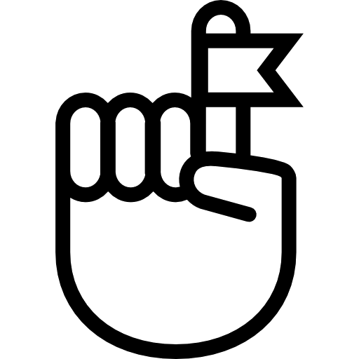
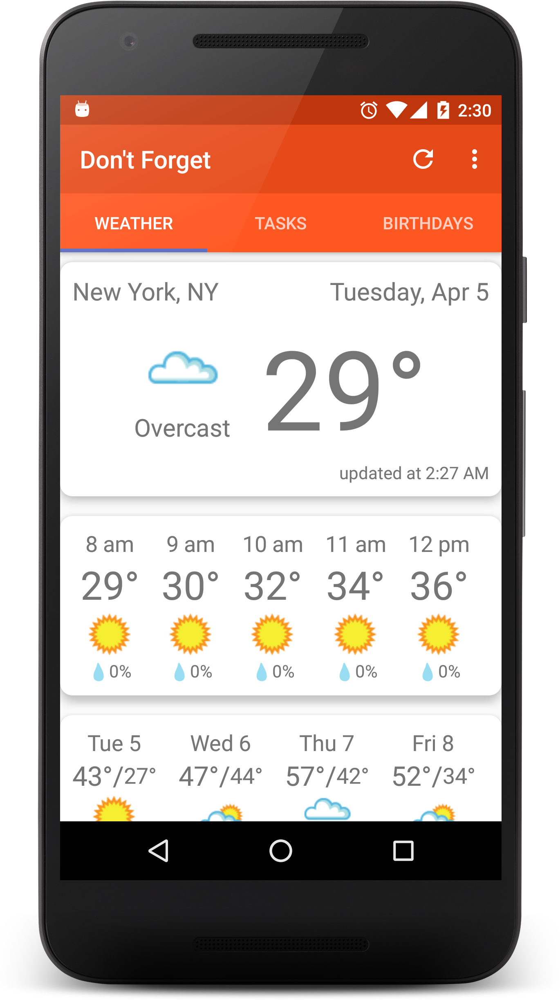
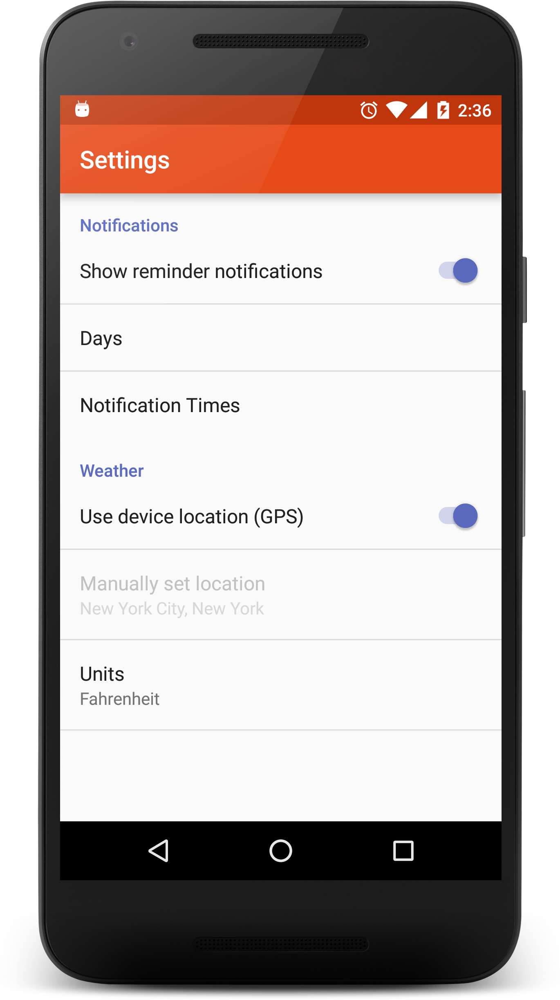

#  Don't Forget

Never get caught in the rain without an umbrella again! Don't Forget gives you timely notifications - customized to your daily routine - in three categories: weather, tasks/errands, and birthdays. These convenient reminders deliver essential data to make your simpler.

###### Weather 
Weather reminders utilize data from the [Weather Underground API] (www.wunderground.com/weather/api/) and provide the essential info you need before you leave the house - likelihood of rain or snow, current, and daily high temps. Clicking through from the notification to the app itself gives you a complete view of current conditions, hourly forecasts (36 hours), and daily forecasts (10 days). The user can also switch between Fahrenheit and Celsius at any time. The most recent weather data is saved locally so that it is available without waiting for a refresh, even when the device is offline.

Weather data is based on the device's current location, or if the user prefers, the app can use a manually-entered location instead. The app provides autocomplete location suggestions when a static location is being entered. If use of the phone's location has been disabled and a manually-entered location has not yet been provided, the user is notified and directed to the Settings screen.

###### Tasks 
Task reminders are designed for time-sensitive errands. Need to mail a rent check on your way to work? No problem, add a "Before Work" reminder. Need to call your doctor during the day to schedule an appointment? Set a "Lunchtime" reminder. You can also choose "On the Way Home" for errands you need to run when you head out from work, and "Evening" for chores to do later. You can customize the time of day associated with each of those labels - set them once, then enjoy the simplicity of picking from four clear labels each time you create a task.

The times associated with each of the four time-of-day labels can be changed at any time via the Settings screen. On the tasks screen, when a task is checked off it automatically moves below the imcomplete tasks in the list. It can be unchecked, or removed by tapping the refresh icon in the toolbar. Task are saved to a local database and persist from session to session.

###### Birthdays 
Birthday reminders connect seamlessly to your Google Contacts and make sure you never miss a chance to send a friend or loved one your best wishes. The notification arrive automatically and include each person's age so you can customize a birthday greeting. You can also easily add and update your contacts' birthdays right from the app - no need to open a separate contacts manager. Don't want to be reminded of some contacts' birthdays? No problem, easily turn birthday notifications on and off by person with a single tap.

The app provides autocomplete suggestions of your contacts' names when searching for a contact to update a birthday. Birthdays can be entered with or without a year, simply by checking or unchecking the "include year" box on the birthday input screen. If a year is not provided, the contact's age is gracefully omitted from notifications and the birthdays screen.

 
